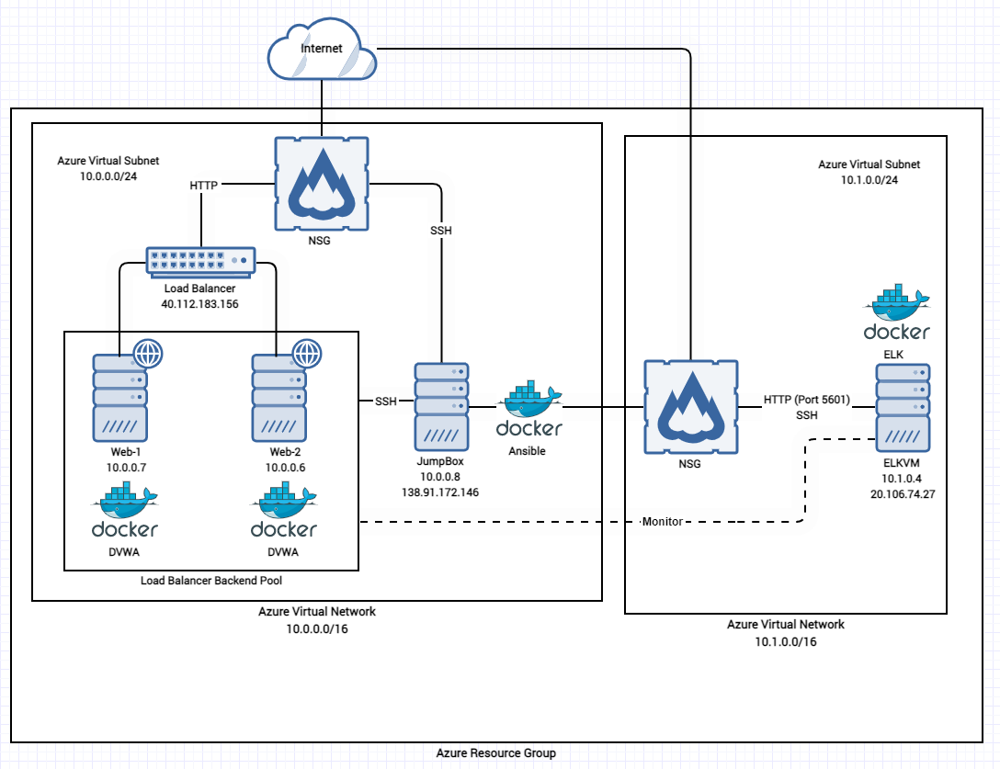

## Automated ELK Stack Deployment

The files in this repository were used to configure the network depicted below.

These files have been tested and used to generate a live ELK deployment on Azure. They can be used to either recreate the entire deployment pictured above. Alternatively, select portions of the YAML file may be used to install only certain pieces of it, such as Filebeat.

  - install-elk.yml
  - filebeat-playbook.yml
  - metricbeat-playbook.yml

This document contains the following details:
- Description of the Topology
- Access Policies
- ELK Configuration
  - Beats in Use
  - Machines Being Monitored
- How to Use the Ansible Build

### Description of the Topology

The main purpose of this network is to expose a load-balanced and monitored instance of DVWA, the D*mn Vulnerable Web Application.

Load balancing ensures that the application will be highly available by distributing the traffic over two webservers. In situations where one server crashes or goes down due to an unexpected error, load balancer can also be used as a backup mechanism and send traffic to the other running server. Load balancer can also be used to restrict unauthorized access to the network.

Integrating an ELK server allows users to easily monitor the vulnerable VMs for changes to the docker metrics and system logs.
- Filebeat monitors the changes in syslog files.
- Metricbeat monitors the resources being used on the host.

The configuration details of each machine may be found below.

| Name     | Function           | Private IP Address | Public IP Address |Operating System |
|----------|--------------------|--------------------|-------------------|-----------------|
| Jump Box | Gateway            | 10.0.0.1           | 138.91.172.146    | Linux           |
| Web-1    | Webserver          | 10.0.0.7           | 40.112.183.156    | Linux           |
| Web-2    | Webserver          | 10.0.0.6           | 40.112.183.156    | Linux           |
| ELKVM    | Centralized Logger | 10.1.0.4           | 20.106.74.27      | Linux           |

### Access Policies

All the machines are publicly facing the Internet. However, to prevent unwanted access to the servers, the network security group only allows connections coming from my IP address to limited ports. 
- 47.34.184.72

Machines within the network can only be accessed by the JumpBox.
- 10.0.0.8

A summary of the access policies in place can be found in the table below.

| Name        | Allowed IP Addresses | Allowed Ports |
|-------------|----------------------|---------------|
| JumpBox     | 47.34.184.72         | 22 (SSH)      |
| Web-1/Web-2 | 10.0.0.8             | 22 (SSH)      |
| Web-1/Web-2 | 47.34.184.72         | 80 (HTTP)     |
| ELKVM       | 10.0.0.8             | 22 (SSH)      |
| ELKVM       | 47.34.184.72         | 5601 (HTTP)   |

### Elk Configuration

Ansible was used to automate configuration of the ELK machine. No configuration was performed manually, which is advantageous because the same configurations can be applied quickly when needed. Whether it be redeploying the same machine or applying the same configurations over multiple machines, only a slight change to the ansible configuration file will set up the machine.

The playbook implements the following tasks:
- Install docker.io, python3-pip
- Allocate enough virtual memory for ELK
- Download ELK docker and start it with ports 5601, 9200, 5044 open
- Enable docker service to restart after reboot

The following screenshot displays the result of running `docker ps` after successfully configuring the ELK instance.

### Target Machines & Beats
This ELK server is configured to monitor the following machines:
- Web-1 : 10.0.0.7
- Web-2 : 10.0.0.6

We have installed the following Beats on these machines:
- Filebeat
- Metricbeat

These Beats allow us to collect the following information from each machine:
- Filebeat monitors various log events such as when sudo commands run, SSH connections are made, and new users or groups are created.
- Metricbeat collects resource metrics from the operating system and services on the server. Some information logged by Metricbeat are CPU usage and memory usage.

### Using the Playbook
In order to use the playbook, you will need to have an Ansible control node already configured. Assuming you have such a control node provisioned: 

SSH into the control node and follow the steps below:
- Copy the filebeat-config.yml and metricbeat-config.yml file to the nodes you want to monitor.
- Update the filebeat-config.yml and metricbeat-config.yml files to include the control node IP address on output.elasticsearch (line #1106) and setup.kibana (line #1806)
- Run the playbook, and navigate to the Filebeat/Metricbeat Installation page in ELK server Kibana GUI to verify the module is successfully receiving data.
